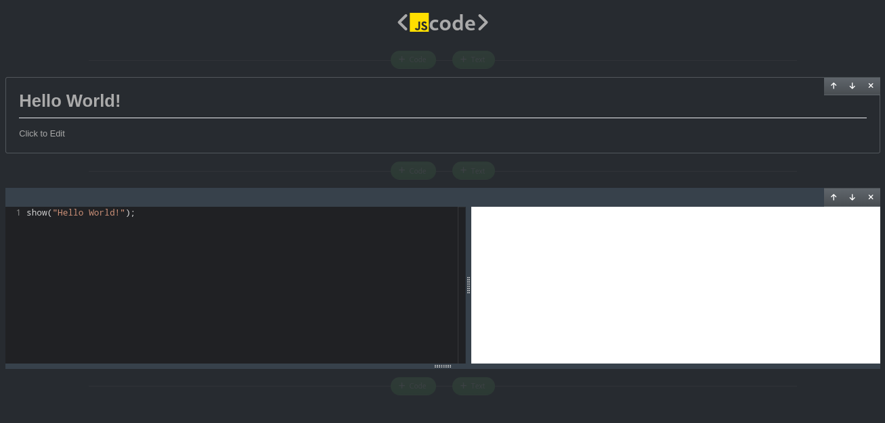

# JScode

This is a web based editor for writting javascript code. Inspired by Jupyter Notebook

Live Demo: [https://tallninja.github.io/jscode](https://tallninja.github.io/jscode)

I have created a special `show()` function which displays data on the output window e.g `show('Hello World!')` prints `Hello World!` on the output screen on the right of the code editor.

## Instructions

### Prerequisites

In order to run the application you need to have [node](https://nodejs.org/en/) installed on your computer. To check whether you have `node` installed you can run the following command in your terminal.

```text
node --version
```

The above command should display the version info of your node installation. You also need a node package manager installed either [npm](https://www.google.com/search?q=npm) or [yarn](https://yarnpkg.com/cli/node). Node comes with `npm` by default which should be more that enough. If you want to use `yarn` instead, you first need to install it using the following command. You can also use a popular tool called [nvm](https://github.com/nvm-sh/nvm) to install node on your computer.

```text
npm install -g yarn
```

### Running the application

If you have node and npm or yarn installed then you can proceed to installing the dependdencies first using

Using `npm`:

```text
npm install
```
OR

Using `yarn`

```text
yarn
```

After running either of the commands wait for the packages to finish installing. After all the packages are installed then you can proceed to running the application

```text
npm run dev
```

OR

```text
yarn run dev
```

This will start a development server on your computer which you can access on [http://localhost:3000](http://localhost:3000).

**Hooray!** the application is now running. On your browser you should see a page that looks like this



You can now play aroun with the notebook.

### Msc

The code is bundled on the client side using [unpkg.com](https://unpkg.com) to include external libraries/packages

The requests are cached in indexedDB using [localforage](https://www.npmjs.com/package/localforage) in order to reduce the number of requests to [unpkg.com](https://unpkg.com)

User's code is executed inside an iframe element in order to provide some level of isolation from the user's browser. By default iframe element allows communication between the parent and the child using `parent` in the child and `\<iframe_element\>.contentWindow` from the parent.
Iframes have sandbox property which allows communcation between the parent and child `sandbox="allow-same-origin"`. To sandbox the iframe we set the sandbox property to an empty string `sandbox=""`.
Another way to disable communication is using a different port, domain name or protocol.
The app uses message event listener to post code from the parent to the child iframe. Passing the code as an attribute to the script tag can be problematic since the code can be really long in the case of external modules also the code can contain tags which can break the code logic.

## Features

- [X] Client side bundling
- [X] External librabies/packages
- [X] Code formating
- [X] Markdown Editor
- [ ] Custom CSS